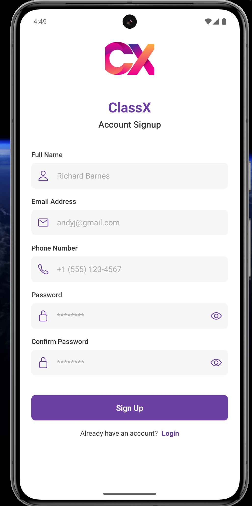

#  ClassX 

<div align="center">


**Your Smart Academic Companion**

_Effortlessly manage your class schedule, stay inspired, and supercharge your academic journey_


</div>

## 🚀 Overview

ClassX is a beautifully designed mobile application that revolutionizes how students interact with their academic schedules. With a sleek, intuitive interface and powerful features, ClassX brings organization, inspiration, and productivity tools to students' fingertips.

## ✅ Key Features

- **Seamless Authentication** - Secure and smooth login/signup experience with Firebase
- **Smart Routine Management** - Intuitive class schedule organization with elegant animations
- **Inspiration Gallery** - Curated content to keep you motivated on your academic journey
- **Productivity Tools** - Essential utilities designed specifically for student needs
- **Personalized Profiles** - Customizable user experience with profile image syncing

## 🛠️ Technology Stack

- **Frontend Framework**: React Native with Expo
- **State Management**: React Hooks
- **Backend & Authentication**: Firebase
- **Navigation**: React Navigation (Stack & Tab)
- **UI Components**: Custom components with Ionicons
- **Animations**: React Native Animated API

## 📱 Screenshots

<div align="center">
<table>
  <tr>
    <td><strong>Login Screen</strong></td>
    <td><strong>Routine View</strong></td>
    <td><strong>Signup Screen</strong></td>
  </tr>
  <tr>
    <td></td>
    <td></td>
    <td></td>
  </tr>
</table>
</div>

## ⚙️ Installation

```bash
# Clone the repository
git clone https://github.com/yourusername/ClassX.git

# Navigate to project directory
cd ClassX

# Install dependencies
npm install

# Start the development server
npx expo start
```

## 📋 Requirements

- Node.js 14.0 or later
- Expo CLI
- iOS Simulator or Android Emulator (optional for mobile testing)

## 👨‍💻 Development

For developers looking to contribute or customize ClassX:

```bash
# Run on iOS
npm run ios

# Run on Android
npm run android

# Run on web
npm run web
```

## 📄 License

This project is licensed under the MIT License - see the LICENSE file for details.

---

<div align="center">
Created with ❤️ by Mir Hossain Ahmed
</div>
